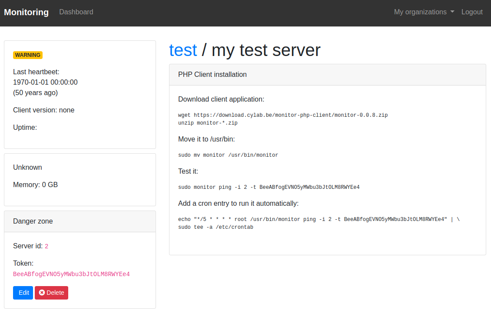
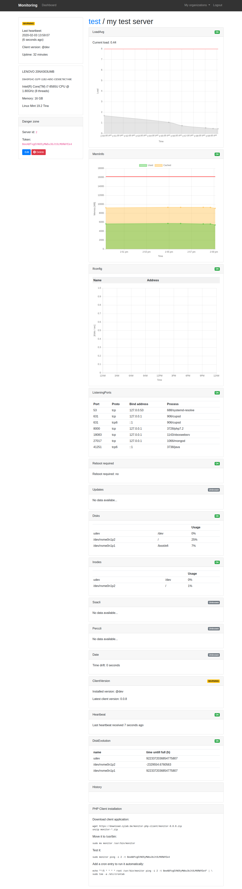

# monitoring-php-client

[](https://gitlab.cylab.be/cylab/monitoring-php-client/-/commits/master)
[](https://gitlab.cylab.be/cylab/monitoring-php-client/-/commits/master)

The PHP client for monitoring.

## Local testing

To test the monitoring-php-client locally:

1. install composer dependencies: ```composer install```

2. **setup and run the monitoring web application** : https://gitlab.cylab.be/cylab/monitoring

3. on the web application, create a server

4. this will provide you with a **server id and token** (on the left side of the web interface)



5. you can now test the monitoring-php-client with following command:
 ```sudo php src/Main.php ping -i <server id> -t <token> -s "http://127.0.0.1:8000"```

 For example:

 ```
 $ sudo php src/Main.php ping -i 2 -t BeeABfogEVNO5yMWbu3bJtOLM8RWYEe4 -s "http://127.0.0.1:8000"
 ```

 This should show you an "ok" message, and the web interface will display the current status of your machine...

 

